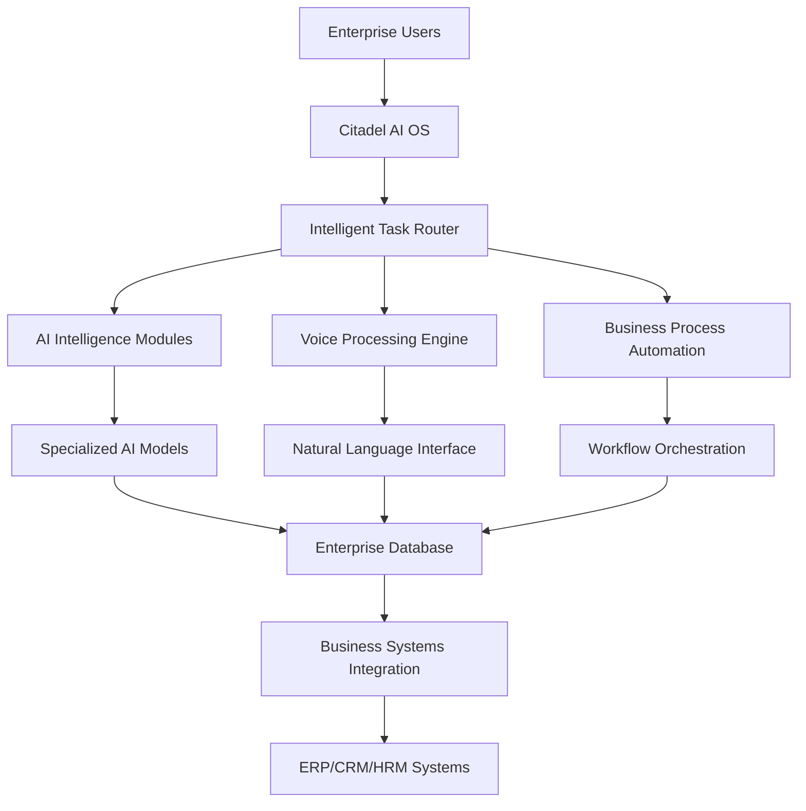

# Citadel AI Operating System
## The Enterprise AI Platform That Transforms Lines of Business

<div align="center">


**The world's first comprehensive AI Operating System designed to revolutionize enterprise operations across all lines of business**

[🚀 Quick Start](#quick-start) • [📖 Documentation](https://citadel-ai-os.github.io) • [🏗️ Architecture](#architecture) • [💼 Business Impact](#business-impact) • [🤝 Community](#community)

</div>

---

## 🎯 **What is Citadel AI OS?**

Citadel AI Operating System is not just another AI platform—it's a **complete enterprise transformation engine** that fundamentally changes how organizations operate. By providing a unified AI infrastructure with specialized intelligence modules, Citadel AI OS enables businesses to automate complex processes, make intelligent decisions, and scale operations with unprecedented efficiency.

### **Why Citadel AI OS Transforms Business**

- **🏢 Enterprise-First Design**: Built specifically for enterprise-scale operations with security, compliance, and governance at its core
- **🧠 Multi-Modal Intelligence**: Seven specialized AI models working in concert to handle every aspect of business operations
- **🔄 Process Automation**: Intelligent automation that adapts to your business workflows and scales with your organization
- **📊 Real-Time Decision Making**: AI-powered insights and automated decision-making across all business functions
- **🎙️ Natural Interaction**: Voice, text, and visual interfaces that make AI accessible to every employee
- **🔗 Seamless Integration**: Native integration with existing enterprise systems and workflows

---

## 🏢 **Lines of Business Transformation**

### **Information Technology**
- **Infrastructure Management**: Automated system monitoring, predictive maintenance, and intelligent resource allocation
- **DevOps Acceleration**: AI-powered code generation, testing, and deployment automation
- **Security Operations**: Intelligent threat detection, automated incident response, and compliance monitoring
- **Service Management**: Automated ticket resolution, intelligent routing, and proactive issue prevention

### **Human Resources**
- **Talent Acquisition**: AI-powered candidate screening, interview automation, and skills matching
- **Employee Experience**: Intelligent onboarding, personalized learning paths, and automated HR processes
- **Performance Management**: Data-driven performance insights and automated review processes
- **Workforce Planning**: Predictive analytics for staffing needs and skills gap analysis

### **Finance & Accounting**
- **Financial Analysis**: Automated reporting, predictive financial modeling, and risk assessment
- **Accounts Processing**: Intelligent invoice processing, automated reconciliation, and fraud detection
- **Compliance Management**: Automated regulatory reporting and compliance monitoring
- **Strategic Planning**: AI-powered financial forecasting and scenario analysis

### **Sales & Marketing**
- **Customer Intelligence**: Advanced customer analytics, behavior prediction, and personalization
- **Sales Automation**: Intelligent lead scoring, automated follow-ups, and sales process optimization
- **Marketing Optimization**: AI-powered campaign management, content generation, and ROI optimization
- **Customer Service**: Automated support, intelligent routing, and proactive customer engagement

### **Operations & Supply Chain**
- **Process Optimization**: Intelligent workflow automation and continuous process improvement
- **Supply Chain Intelligence**: Predictive inventory management, supplier optimization, and risk mitigation
- **Quality Management**: Automated quality control, defect prediction, and compliance monitoring
- **Resource Planning**: AI-powered capacity planning and resource optimization

---

## 🏗️ **Architecture**

### **Core AI Intelligence Modules**

| Module | Specialization | Business Impact |
|--------|----------------|-----------------|
| **Mixtral-8x7B** | Strategic Reasoning | Executive decision support, complex problem solving |
| **Nous Hermes 2** | Knowledge Processing | Document analysis, research automation, compliance |
| **OpenChat 3.5** | Communication | Customer service, internal communications, training |
| **Phi-3 Mini** | Rapid Processing | Real-time decisions, instant responses, edge computing |
| **Yi-34B** | Deep Analysis | Long-form analysis, strategic planning, research |
| **DeepCoder-14B** | Technical Intelligence | Code generation, system automation, technical support |
| **MiMo-VL-7B** | Multi-Modal Processing | Visual analysis, document processing, quality control |

### **Enterprise Infrastructure**



### **Technology Stack**

- **🧠 AI Engine**: vLLM with optimized inference for enterprise workloads
- **🎙️ Communication**: Multi-modal interface supporting voice, text, and visual interaction
- **🔄 Orchestration**: Intelligent task routing and workflow automation
- **🗄️ Data Layer**: Enterprise-grade database with real-time analytics
- **🔐 Security**: Enterprise security framework with audit trails and compliance
- **📊 Monitoring**: Comprehensive observability and performance analytics
- **🔗 Integration**: Native connectors for major enterprise platforms

---

## 💼 **Business Impact**

### **Immediate Benefits**

- **⚡ 70% Reduction** in routine task processing time
- **📈 45% Increase** in operational efficiency across departments
- **💰 60% Cost Savings** in manual process automation
- **🎯 90% Improvement** in decision-making speed and accuracy
- **📊 Real-Time Insights** across all business operations
- **🔄 24/7 Operations** with intelligent automation

### **Strategic Advantages**

- **🚀 Digital Transformation**: Complete AI-powered business transformation
- **🏆 Competitive Edge**: Advanced AI capabilities not available elsewhere
- **📈 Scalable Growth**: Infrastructure that grows with your business
- **🔮 Future-Ready**: Platform designed for emerging AI technologies
- **🌐 Global Operations**: Support for multi-language, multi-region operations
- **🤝 Employee Empowerment**: AI tools that enhance human capabilities

---

## 🚀 **Quick Start**

### **Prerequisites**
- Ubuntu 22.04+ or compatible Linux distribution
- NVIDIA GPU with 32GB+ VRAM (RTX 4070 Ti SUPER or better)
- 128GB+ RAM
- 2TB+ NVMe storage
- Network access to your enterprise database server

### **Installation**

```bash
# Clone the repository
git clone https://github.com/your-org/citadel-ai-os.git
cd citadel-ai-os

# Configure your environment
cp config/environment/.env.example config/environment/.env.production
# Edit .env.production with your configuration

# Install Citadel AI OS
chmod +x install.sh
./install.sh

# Verify installation
./scripts/management/health_check.sh
```

### **First Steps**

```bash
# Access the AI OS interface
curl http://localhost:8000/health

# Start a business process
curl -X POST http://localhost:8000/api/process/start \
  -H "Content-Type: application/json" \
  -d '{"process": "customer_onboarding", "entity": "new_customer"}'

# Query business intelligence
curl -X POST http://localhost:8000/api/intelligence/query \
  -H "Content-Type: application/json" \
  -d '{"query": "Generate quarterly sales analysis"}'
```

---

## 📊 **Enterprise Features**

### **🔐 Security & Compliance**
- **Enterprise Authentication**: Integration with Active Directory, LDAP, SSO
- **Data Protection**: End-to-end encryption, data residency controls
- **Audit Trails**: Comprehensive logging and compliance reporting
- **Access Controls**: Role-based permissions and data governance

### **📈 Scalability & Performance**
- **Auto-Scaling**: Dynamic resource allocation based on demand
- **Load Balancing**: Intelligent distribution across AI modules
- **High Availability**: Redundant systems with automatic failover
- **Performance Optimization**: Continuous optimization for enterprise workloads

### **🔗 Integration Capabilities**
- **ERP Systems**: SAP, Oracle, Microsoft Dynamics integration
- **CRM Platforms**: Salesforce, HubSpot, Microsoft CRM connectivity
- **Communication**: Slack, Teams, email system integration
- **Data Sources**: Database, API, file system, and cloud storage connectors

### **📊 Analytics & Insights**
- **Business Intelligence**: Real-time dashboards and reporting
- **Predictive Analytics**: AI-powered forecasting and trend analysis
- **Performance Metrics**: KPI tracking and automated alerts
- **Custom Reports**: Automated report generation and distribution

---

## 🛠️ **Configuration**

### **Environment Setup**

```bash
# Database Configuration
DB_HOST=your-database-server.com
DB_NAME=citadel_ai_os
DB_USER=citadel_admin

# AI Processing Configuration
GPU_MEMORY_UTILIZATION=0.85
MAX_CONCURRENT_REQUESTS=100
MODEL_CACHE_SIZE=50GB

# Business Integration
ERP_INTEGRATION_ENABLED=true
CRM_INTEGRATION_ENABLED=true
EMAIL_INTEGRATION_ENABLED=true

# Security Configuration
ENTERPRISE_AUTH_ENABLED=true
AUDIT_LOGGING_ENABLED=true
DATA_ENCRYPTION_ENABLED=true
```

### **Service Management**

```bash
# Start all services
sudo systemctl start citadel-ai-os

# Check system status
sudo systemctl status citadel-ai-os

# View system logs
journalctl -u citadel-ai-os -f

# Health monitoring
./scripts/management/health_check.sh
```

---

## 📖 **Documentation**

### **📚 Complete Documentation Suite**
- **[Installation Guide](docs/installation.md)** - Complete setup and deployment
- **[Configuration Reference](docs/configuration.md)** - System configuration options
- **[API Documentation](docs/api.md)** - Complete API reference
- **[Business Integration](docs/business-integration.md)** - Enterprise system integration
- **[Security Guide](docs/security.md)** - Security implementation and best practices
- **[Troubleshooting](docs/troubleshooting.md)** - Issue resolution and support

### **🎓 Learning Resources**
- **[Quick Start Tutorial](docs/tutorials/quick-start.md)** - Get started in 30 minutes
- **[Business Process Automation](docs/tutorials/process-automation.md)** - Automate your workflows
- **[AI Model Configuration](docs/tutorials/ai-configuration.md)** - Optimize AI performance
- **[Integration Patterns](docs/tutorials/integration-patterns.md)** - Connect with existing systems

---

## 🤝 **Community**

### **🌟 Contributing**
We welcome contributions from the enterprise AI community:
- **[Contributing Guide](CONTRIBUTING.md)** - How to contribute to the project
- **[Code of Conduct](CODE_OF_CONDUCT.md)** - Community guidelines
- **[Development Setup](docs/development.md)** - Set up your development environment

### **💬 Support & Discussion**
- **[GitHub Discussions](https://github.com/your-org/citadel-ai-os/discussions)** - Community discussions
- **[Issue Tracker](https://github.com/your-org/citadel-ai-os/issues)** - Bug reports and feature requests
- **[Enterprise Support](mailto:enterprise@citadel-ai-os.com)** - Professional support services

### **📢 Stay Connected**
- **[Documentation Site](https://citadel-ai-os.github.io)** - Complete documentation
- **[Blog](https://blog.citadel-ai-os.com)** - Latest updates and insights
- **[LinkedIn](https://linkedin.com/company/citadel-ai-os)** - Professional updates
- **[Twitter](https://twitter.com/citadel_ai_os)** - News and announcements

---

## 📄 **License**

Citadel AI Operating System is released under the [MIT License](LICENSE).

---

## 🚀 **Transform Your Business Today**

Citadel AI Operating System represents the future of enterprise operations. By providing a comprehensive AI platform that integrates seamlessly with your existing business processes, Citadel AI OS enables organizations to:

- **Automate Complex Workflows** with intelligent process automation
- **Make Data-Driven Decisions** with real-time AI insights
- **Scale Operations Efficiently** with adaptive AI infrastructure
- **Enhance Employee Productivity** with AI-powered tools
- **Accelerate Digital Transformation** across all business functions

**Ready to transform your organization?** [Get started today](#quick-start) and join the AI-powered enterprise revolution.

---

<div align="center">

**Citadel AI Operating System** - *Transforming Enterprise Operations Through Artificial Intelligence*

[](https://github.com/your-org/citadel-ai-os/stargazers)
[](https://github.com/your-org/citadel-ai-os/network/members)
[](https://github.com/your-org/citadel-ai-os/watchers)

</div>

